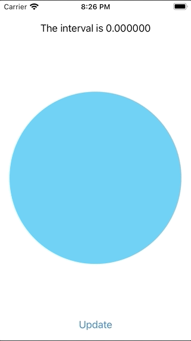

# Custom Dynamic Properties

This project demonstrates how to make a custom `DynamicProperty` that will cause a SwiftUI View to rebuild it self when the property updates.

There are 2 steps to creating a dynamic property:  
  * Declare a `@propertyWrapper` that conforms to `DynamicProperty`.
  * Add a `@StateObject` to the wrapper that is used to back the `wrappedValue` for the property wrapper.

Whenever the `@StateObject` emits an `objectWillChange` event (ie through a change to one of its `@Published` properties), the subscribed property wrapped will cause the View to update.  This happens through the default implmentation of `DynamicProperty`'s update function, which is provided by Apple.

https://developer.apple.com/documentation/swiftui/dynamicproperty

This project provides two sample custom `@propertyWrapper`'s:

## Interval

`@Interval` is a property wrapper that provides a timer that updates with the elapsed time.
  ```
    @Interval(seconds: 1) private var time: TimeInterval
  ```
It provides methods to stop and reset as well as start the timer:
```
.onAppear { _time.start() }
.onDisappear { _time.stop() }
```

## Notify
`@Interval` is a property wrapper that can subscribe to any `Foundation.Notification` and transform it into another type (such as by inspecting its userInfo dictionary).
```
  @Notify(
    notificationName: UIApplication.userDidTakeScreenshotNotification,
    transform: { _ in Date() }
  ) private var screenshotDate: Date?
```

